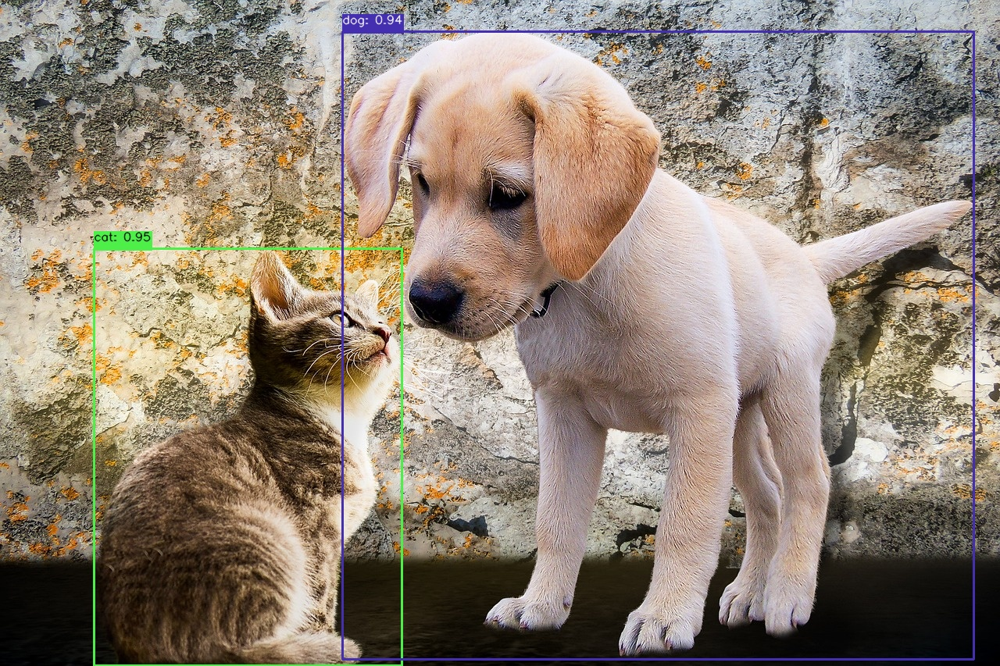

# Delphi YOLO ONNX Runtime wrapper

___


<br/>
<br/>

- [Introduction](#Introduction)
    - [What is Delphi YOLO ONNX Runtime wrapper?](#what-is-delphi-yolo-onnx-runtime-wrapper)
    - [Remarks](#remarks)
- [Supported platforms](#supported-platforms)    
- [Customizing the Runtime Environment](#customizing-the-runtime-environment)
- [Installing the Development Environment](#installing-the-development-environment)
- [Package composition](#package-composition)
    - [python_common folder](#python_common-folder)
    - [ONNXRT_core folder](#onnxrt_core-folder)
- [How to use](#how-to-use)
- [Prediction example](#prediction-example)
- [License](#license)
 
<br/>
<br/>

# Introduction

## What is Delphi YOLO ONNX Runtime wrapper?
The Delphi YOLO ONNX Runtime wrapper is a singleton interface which provides loading and running a YOLO deep machine learning model (https://docs.ultralytics.com/) from the Delphi applications. It allows you to detect objects in an image with Delphi using Object Pascal programming language. We made an easy access to the artificial intelligence (AI) computer vision model for your VCL and FMX applications.<br/>

This project implements the following functions:
1. Obtaining metadata from the model in ONNX format.
2. Recognizing 80 predefined classes using trained YOLO models in ONNX format.

It is possible to expand the functionality to use the ONNX format for other types of models.

To use models in ONNX Runtime, you can convert YOLO models to ONNX format. For more information, see: https://docs.ultralytics.com/integrations/onnx/

<br/>

## Remarks

<br/>

> [! NOTE]
>
> YOLO models are provided under AGPL-3.0 and Enterprise licenses.

<br/>

> [! IMPORTANT]
>
> This is an unofficial library. **Delphi YOLO ONNX Runtime wrapper** does not provide any official library for `Delphi` or for `YOLO`.

<br/>

# Supported platforms
These limitations stem from the use of the ONNX runtime API.
>Windows (x64), Linux (x64, ARM64), Mac (X64)

<br/>

# Customizing the Runtime Environment
The YOLO ONNX Runtime is accessed by running Python code.
Python is not installed by default on the operating system. You can download the required version of Python from python.org:
https://www.python.org/downloads/

>At this stage it is necessary to decide which platform will be used. 
 It should be noted that only 32-bit environment is provided for VCL development. 
 Using 64-bit version is possible only for the FMX framework.<br/>

Make sure you have Python installed and pip (package manager) is up to date.

```
python -m pip install --upgrade pip
```

Once python is successfully installed, open the command prompt and use pip to install numpy.

```
pip install numpy
```

In the next step, install ONNX Runtime. For more information, visit the official ONNX Runtime website: https://onnxruntime.ai

Install ONNX Runtime CPU: 

```
pip install onnxruntime
```

If necessary, install ONNX Runtime GPU:
Install ONNX Runtime GPU (DirectML): 

```
pip install onnxruntime-directml
```

Install ONNX Runtime GPU (CUDA 12.x):

```
pip install onnxruntime-gpu
```

Downloading and installing OpenCV:
OpenCV can be downloaded and installed directly using pip. To install OpenCV, simply go to the command line and enter the following command:

```
pip install opencv-python
```

<br/>

# Installing the Development Environment
The [Python4Delphi](https://github.com/pyscripter/python4delphi) (P4D) library is used to access Python objects from Delphi.

There are several ways of installation.
1. Use GetIt Package manager
2. Use GitHub: https://github.com/pyscripter/python4delphi

<br/>

YOLO **OnnxRTWrapper** can be installed using a package or manually by copying the contents of the source folder.
Download or clone repository. Open project **package/OnnxRTWrapper.dpk**, build and install by IDE.

Then go to: 
```
   Tools-Options-Language-Delphi-Library
``` 
and tell the IDE where to find the sources. 
You should modify the **"Library Path"** and the **"Browsing path"**. 
Add folders: **source**, **python_common** and **ONNXRT_core**. 
Repeat it for both Windows 32 and Windows 64 platforms.

<br/>

# Package composition

## python_common folder

- **Python.Manager.pas**

  This is a wrapper for the [Python4Delphi](https://github.com/pyscripter/python4delphi) library, as a singleton pattern.
  This allows to run Python code through Delphi functions. 

- **Python.ONNXRT.Code.pas**

  These are python code functions used for detection by the ONNX Runtime.

- **Python.Yolo.Code.pas**

  These are python code functions for [Ultralytics](https://www.ultralytics.com) YOLO models.

<br/>

## ONNXRT_core folder

- **ONNXRT.Constants.pas**

  These are the constants for the ONNX Runtime detection.

  ```pascal
    {OnnxRT detection value names}
    S_INPUT_IMAGEFILE = 'input_imagefile';
    S_OUT_IMAGEFILE = 'out_imagefile';
    S_MODELFILE = 'modelfile';
    S_PROVIDERS = 'providers';
    S_FILTERCLASSES = 'filterclasses';
    S_CONFIDENCE_THRESHOLD = 'cf_threshold';
    S_IOU_THRESHOLD ='iou_threshold';
    S_MODELTYPE = 'modeltype';
  ```

  ```pascal
    {options for python code generating}
    pcDrawDetected = 1; //Generate draw code
    pcLoad = 2; //Generate code to open image
    pcSave = 4; //Generate code to save processed image
    pcEnableIO = 7; //Mask options - only lad and save section
    pcDisableIO = High(Word) - pcEnableIO; //Mask options - exclude load and save section
    pcAddImport = 8; //Add import code
    pcAddDefinitions = 16; //Add definitions to code
    pcFullCode = High(Word);

  ```

- **ONNXRT.Types.pas**

  These are the types for the ONNX Runtime detection.

  ```pascal
    type
        TModelType = (mtYolo); 
        TProcessStatus = (psNone, psInitialization, psInitialized, psProcessing, psFinished, psError);
 
  ```

  ```pascal
  {Record for access to metadata of ONNX}
  TMetadata = record
    model_description: string;
    model_domain: string;
    graph_description: string;
    graph_name: string;
    producer_name: string;
    model_version: string;
    { Custom metadata map }
    date: string;
    description: string;
    author: string;
    version: string;
    task: string;
    license: string;
    docs: string;
    stride: string;
    batch: string;
    imgsz: string;
    names: string;

    inputs: TArray<string>;
    outputs: TArray<string>;
  public
    procedure AddInput(const aInput: string);
    procedure AddOutput(const aOutput: string);
  end;
  ```


- **ONNXRT.Utils.pas**

  These are the common functions used by the YOLO ONNX Runtime wrapper library classes.

- **ONNXRT.Classes.pas**

  These are classes and interfaces of the detection results.

- **ONNXRT.Core.pas**

  This is base class and interface of the OnnxRTWrapper.

<br/>

<br/>

# How to use
The first time the interface is accessed, events must be registered and initialization must be performed.
The interface can be accessed by calling the global function:

```pascal
function OnnxrtWrapper: IOnnxrtWrapper;
```
or by class instance:
```pascal
TOnnxrtWrapper.Instance
```
It is possible to subscribe for status changes:
```pascal
    /// <summary> Registering a status change event. </summary>
    procedure RegisterStatusEvent(aStatusEvent: TProc<TObject, Integer, string>);
    /// <summary> Unregistering a status change event. </summary>
    procedure UnRegisterStatusEvent(aStatusEvent: TProc<TObject, Integer, string>);
```
For example:
```pascal
procedure TfrmONNXDetection.OnStatusChange(Sender: TObject; aIntStatus: Integer;
  aStrStatus: string; aComplete: Boolean);
begin
  memoLog.Lines.Add(EmptyStr);
  memoLog.Lines.Add(lblStatus.Text + aStrStatus);
  if aStrStatus.Equals('error') then
    memoLog.Lines.Add(OnnxrtWrapper.LastError);
  lblStatusName.Text := aStrStatus;
  lblTimeValue.Text := OnnxrtWrapper.ProcessTime.AsString;
  lblFunctionTimeValue.Text := OnnxrtWrapper.FunctionTime.AsString;
  if aComplete then
  begin
    btnSetPython.Visible := not OnnxrtWrapper.IsInitialized;
    memoLog.Lines.Add(lblProcessTime.Text + lblTimeValue.Text);
    memoLog.Lines.Add(lblFunctionTime.Text + lblFunctionTimeValue.Text);
  end;
  Application.ProcessMessages;
end;
...
procedure TfrmONNXDetection.FormCreate(Sender: TObject);
begin
  //Registering a status changing event
  OnnxrtWrapper.RegisterStatusEvent(OnStatusChange);
  //Registering a result addition event
  OnnxrtWrapper.DetectionResults.OnAddDetected :=
    procedure(Sender: TObject; aObject: IDetectedObject)
      begin
        memoLog.Lines.Add(EmptyStr);
        memoLog.Lines.Add('DetectionResults.OnAddDetected');
        memoLog.Lines.Add('  box (x,y,w,h) = [' + aObject.Box.Left.ToString
          + ', ' + aObject.Box.Top.ToString
          + ', ' + aObject.Box.Width.ToString
          + ', ' + aObject.Box.Height.ToString + ']');
        memoLog.Lines.Add('  score = ' + aObject.Score.ToString);
        memoLog.Lines.Add('  class index = ' + aObject.ClassIndex.ToString);
        memoLog.Lines.Add('  class name = ' + aObject.ClassLabel);
      end;

  sbCfThreshold.Text := OnnxrtWrapper.DetectionValue[S_CONFIDENCE_THRESHOLD];
  sbIouThreshold.Text := OnnxrtWrapper.DetectionValue[S_IOU_THRESHOLD];
end;

```
When API functions are called, initialization and connection to the Python module will be done automatically. 
But if desired or in case of failure, initialization is performed by calling the **Initialize** function with the full path to the Python library.
```pascal
function Initialize(const aDllName: string = ''): Boolean;
```
<br/>

After each operation, we will have modified data about the current state:

**OnnxrtWrapper.ProcessStatus**: the status of current process.<br/>
**OnnxrtWrapper.FunctionTime**: elapsed time of Python code execution.<br/>
**OnnxrtWrapper.ProcessTime**: elapsed time of current process.<br/>
**OnnxrtWrapper.LastError**: the last operation error description.<br/>

Next, we can retrieve the model metadata:
```pascal
var LMeta := OnnxrtWrapper.GetMetadata;
```
For example:
```pascal
procedure TfrmONNXDetection.btnModelpropClick(Sender: TObject);
begin
  var LMeta := OnnxrtWrapper.GetMetadata;
  if OnnxrtWrapper.ProcessStatus <> psError then
  begin
    memoLog.Lines.Add(EmptyStr);
    memoLog.Lines.Add('METADATA:');
    memoLog.Lines.Add('  model_description = ' + LMeta.model_description);
    memoLog.Lines.Add('  model_domain = ' + LMeta.model_domain);
    memoLog.Lines.Add('  graph_description = ' + LMeta.graph_description);
    memoLog.Lines.Add('  graph_name = ' + LMeta.graph_name);
    memoLog.Lines.Add('  producer_name = ' + LMeta.producer_name);
    memoLog.Lines.Add('  model_version = ' + LMeta.model_version);
    memoLog.Lines.Add('  date = ' + LMeta.date);
    memoLog.Lines.Add('  description = ' + LMeta.description);
    memoLog.Lines.Add('  author = ' + LMeta.author);
    memoLog.Lines.Add('  version = ' + LMeta.version);
    memoLog.Lines.Add('  task = ' + LMeta.task);
    memoLog.Lines.Add('  license = ' + LMeta.license);
    memoLog.Lines.Add('  docs = ' + LMeta.docs);
    memoLog.Lines.Add('  stride = ' + LMeta.stride);
    memoLog.Lines.Add('  batch = ' + LMeta.batch);
    memoLog.Lines.Add('  imgsz = ' + LMeta.imgsz);
    memoLog.Lines.Add('  names = ' + LMeta.names);
    memoLog.Lines.Add('INPUTS:');
    for var i := Low(LMeta.inputs) to High(LMeta.inputs) do
      memoLog.Lines.Add('  input[' + i.ToString + '] = ' + LMeta.inputs[i]);
    memoLog.Lines.Add('OUTPUTS:');
    for var i := Low(LMeta.outputs) to High(LMeta.outputs) do
      memoLog.Lines.Add('  output[' + i.ToString + '] = ' + LMeta.outputs[i]);
  end;
end;
```

From the metadata, you can get the names of the classes used in the model:
```pascal
    /// <summary>
    ///   Getting the list of model classes from metadata record.
    ///   Format is: "Index: 'ClassName'".
    /// </summary>
    function GetModelClasses(const aMeta: TMetadata): string;
```

For the prediction we have overloaded functions:
```pascal
    /// <summary>
    ///   Main detection procedure.
    /// </summary>
    /// <param name="aValues">
    ///   Detection values used.
    ///   If not assigned, the internal detection values are used.
    ///   If the output image file name is set, the image will be saved.
    /// </param>
    /// <return> True when success. </return>
    function Predict(aValues: TDictionary<string, string> = nil): Boolean; overload;
    /// <summary>
    ///   Main detection procedure.
    ///   Parameters are detection values.
    ///   If the output image file name "aOutImagefile" is set, the image will be saved.
    /// </summary>
    /// <return> True when success. </return>
    function Predict(const aModelFile, aImagefile : string;
      const aOutImagefile: string = '';
      const aProviders: string = '';
      const aFilterClasses: string = '';
      const acfThreshold: string = '';
      const aiouThreshold: string = '';
      const aModelType: string = ''): Boolean; overload;

```

For the prediction function, you must specify the initial data. The main ones are: 
1. Model file name.
2. Image file name.

If we intend to save the obtained result, it is necessary to specify the output image file name. 
All other parameters can be omitted, as they will either use default values or retain the last assigned values.

```pascal
uses
  ONNXRT.Core, ONNXRT.Classes, ONNXRT.Constants, ONNXRT.Types;

with OnnxrtWrapper do
begin
  DetectionValue[S_MODELFILE] := '../model.onnx';
  DetectionValue[S_PROVIDERS] := 'CUDAExecutionProvider, CPUExecutionProvider'; //if empty CPUExecutionProvider is default
  DetectionValue[S_INPUT_IMAGEFILE] := './img/cat.jpg';
  DetectionValue[S_OUT_IMAGEFILE] := './img/cat-dt.jpg';
  DetectionValue[S_CONFIDENCE_THRESHOLD] := '0.5'; // it is default
  DetectionValue[S_IOU_THRESHOLD] := '0.5'; // it is default
  DetectionValue[S_MODELTYPE] := 'yolo'; // it is default
  DetectionValue[S_FILTERCLASSES] := '"cat", "person"';
  if Predict then
  begin
    if FileExists(OnnxrtWrapper.DetectionValue[S_OUT_IMAGEFILE]) then
      imgDetectedImage.Bitmap.LoadFromFile(OnnxrtWrapper.DetectionValue[S_OUT_IMAGEFILE]);
  end;
end;
```
The results are accessed through the DetectionResults property.
It is an interface list of detected objects with properties:

**Box**: TRectF - Detected class boundaries.<br/>
**Score**: Double - Detected class score.<br/>
**ClassIndex**: Integer - Detected class index.<br/>
**ClassLabel**: string - Detected class name.<br/>
**Color**: TAlphaColor - Generated color for detected class.<br/>

>Important: Boxes are snapped to the dimensions of the original image.<br/>

Enumeration is available:

```pascal
    for var V in OnnxrtWrapper.DetectionResults do
    begin
      memoLog.Lines.Add('  score = ' + V.Score.ToString);
      memoLog.Lines.Add('  class index = ' + V.ClassIndex.ToString);
      memoLog.Lines.Add('  class name = ' + V.ClassLabel);
    end;
```
You can define an event that occurs when a result is added:
```pascal
    property OnAddDetected: TProc<TObject, IDetectedObject>;
    ...
    OnnxrtWrapper.DetectionResults.OnAddDetected := 
      procedure(Sender: TObject; aObject: IDetectedObject)
        begin
          ...
        end;
```
<br/>

# Prediction example
The project has a demo program **OnnxDetectionTest** that we use to test the functionality of the library. The program is executed as an FMX-project for the 64-bit platform.
<br/>
In our work, we used a trained YOLO11l model converted to ONNX format.

```
  @software{yolo11_ultralytics,
    author = {Glenn Jocher and Jing Qiu},
    title = {Ultralytics YOLO11},
    version = {11.0.0},
    year = {2024},
    url = {https://github.com/ultralytics/ultralytics},
    orcid = {0000-0001-5950-6979, 0000-0002-7603-6750, 0000-0003-3783-7069},
    license = {AGPL-3.0}
  }
```

Images were sourced from https://pixabay.com/

<br/>

Initial data and processing results


Detected classes


Example of prediction #1


Example of prediction #2


<br/>

# License

This project is licensed under the [MIT](https://choosealicense.com/licenses/mit/) License.
